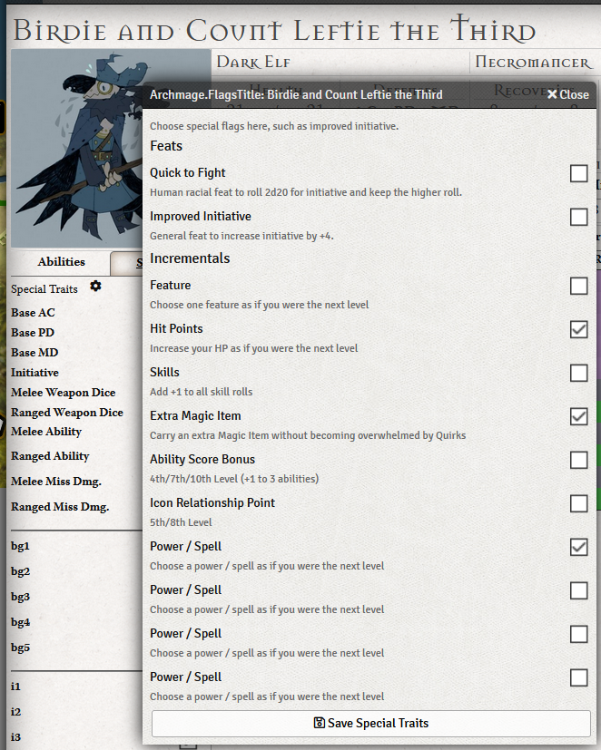
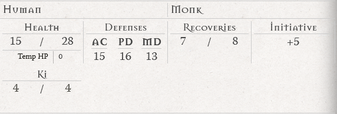
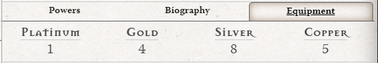
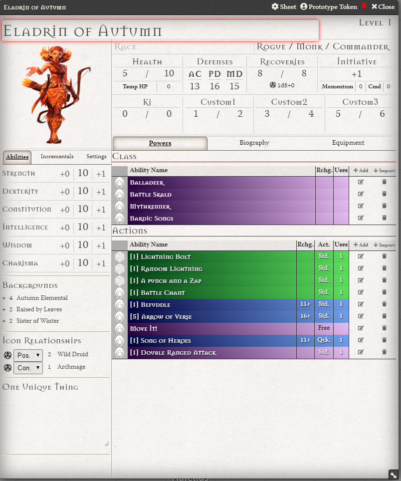

[](https://github.com/cswendrowski/foundryget)
[](https://www.buymeacoffee.com/T2tZvWJ)

# FoundryVTT Mageflame Expanded

A small set of additional features for https://gitlab.com/asacolips-projects/foundry-mods/archmage/tree/master

# Installation

Using [FoundryGet](https://github.com/cswendrowski/foundryget)

```
foundryget install https://raw.githubusercontent.com/cswendrowski/FoundryVTT-Mageflame-Expanded/releases/latest/module.json
```


# Features

Features that are ~~struck-through~~ have been absorbed into Archmage

1) ~~Keep track of your Incrementals!~~



2) ~~For all the Monks in your life, keep track of your Ki~~



3) ~~Also Commanders can keep track of Command Points (CP) and Rogues their Momentum!~~

6) ~~Coin tracking~~



7) ~~For those who deal in rarer coins, an optional world setting for the full list of coins from the Corebook~~


8) A new sheet that reorganizes how Powers are shown


